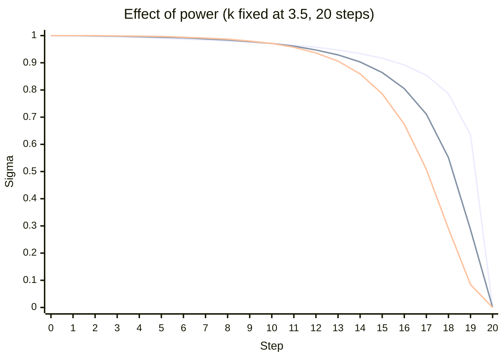
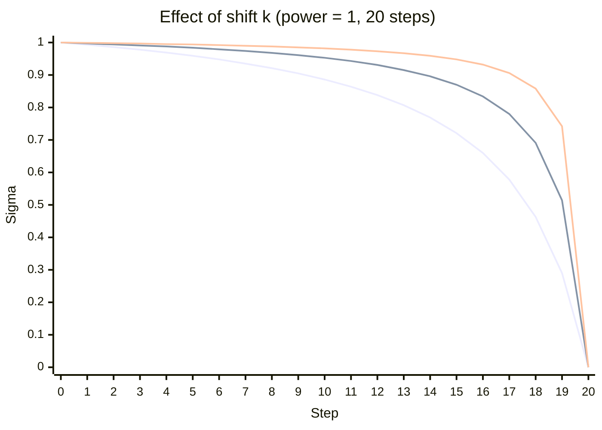
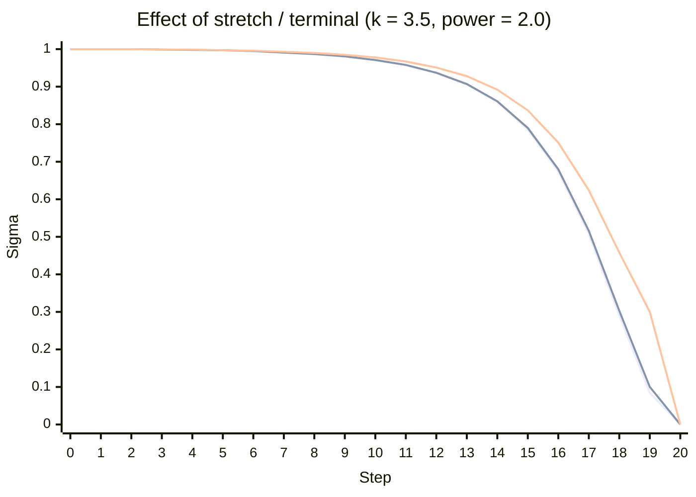
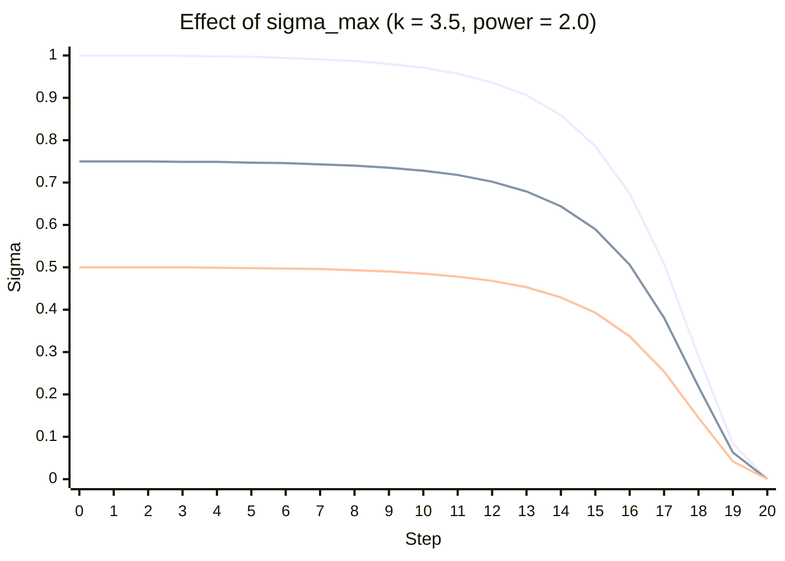

# alt_ltx23_scheduler

A variation on the ComfyUI LTX 2.3 scheduler (`LTXVScheduler`) that exposes the
**`power`** exponent, so you can decouple *how high the schedule holds* from
*how steeply it leaves the midpoint*.

The node is registered as **LTXVScheduler (Power)** under
`model/sampling/schedulers`. The stock node is left untouched.

> ⚠️ This mirrors the **v0.24.0** stock LTXV scheduler math. If Lightricks
> changes the upstream formula in a future ComfyUI release, this fork won't
> track it automatically.

## The formula

Each linspace value `s` (running `1 → 0` across the steps) is mapped to a sigma:

```
                    e^k
σ(s) =  ───────────────────────────         k = sigma_shift,  derived from
        e^k + (1/s − 1) ^ power                  max_shift / base_shift / tokens
```

- `k` (the **shift**) is a linear function of the latent token count, with
  `base_shift` at 1024 tokens and `max_shift` at 4096 tokens. Setting
  `max_shift == base_shift` pins `k` to that value regardless of token count.
- `power` is the new knob. It only touches the `(1/s − 1)` term, which equals
  `1` at the midpoint (`s = 0.5`) — so **`power` changes the slope at the
  midpoint without changing the value there.** `power = 1.0` reproduces the
  stock node exactly.

## `power` — the headline parameter

Held at `max_shift = base_shift = 3.5` (so `k = 3.5`, ~0.97 at step 10), varying
only `power`. All three curves share the same midpoint value; higher `power`
drops out of it faster and spreads the descent more evenly instead of cliffing
at the final step.



Lines top-to-bottom in the second half: **`power = 1.0`** (stock, flat-then-cliff),
**`power = 1.5`**, **`power = 2.0`** (steepest exit, gentlest final step).
Recommended starting range: **1.5 – 2.0**.

| step | power 1.0 | power 1.5 | power 2.0 |
|-----:|:---------:|:---------:|:---------:|
| 10   | 0.971     | 0.971     | 0.971     |
| 12   | 0.957     | 0.947     | 0.936     |
| 14   | 0.934     | 0.903     | 0.859     |
| 16   | 0.892     | 0.805     | 0.674     |
| 18   | 0.786     | 0.551     | 0.290     |
| 19   | 0.635     | 0.286     | 0.084     |

## `max_shift` / `base_shift` — the shift `k`

With `power = 1` (stock behavior), raising the shift holds the curve nearer to 1
for longer — but because it's a plain logistic, a higher hold *necessarily*
flattens the midpoint and pushes the descent into the last few steps. This is
the coupling that `power` was added to break.



Lines bottom-to-top: **`k = 2.05`** (stock default), **`k = 3.0`**, **`k = 4.0`**.
Note how `k = 4.0` clings to 1.0 then falls off a cliff — exactly the shape
`power` is meant to fix.

> **Tip:** set `max_shift == base_shift` to make `k` independent of the latent's
> token count, so the schedule doesn't drift when you change resolution or
> frame count.

## `stretch` / `terminal`

`stretch` linearly remaps the non-zero sigmas so the last one lands on
`terminal` instead of near 0. It's a rescale, not a reshape — it lifts the tail
without changing the overall curvature. Shown here on top of `k = 3.5,
power = 2.0`.



Lines bottom-to-top in the tail: **stretch off**, **`terminal = 0.1`**,
**`terminal = 0.3`**. The final step still snaps to 0 either way.

## `sigma_max` — scale the whole curve

A final scalar multiply applied *after* everything else. The schedule's natural
peak is `1.0` at the first step, so `sigma_max` simply becomes the new starting
sigma and every other value scales by the same factor. `1.0` is a no-op; the
trailing `0` is preserved (`0 × x = 0`). Shown on `k = 3.5, power = 2.0`.



Lines top-to-bottom: **`sigma_max = 1.0`**, **`0.75`**, **`0.5`** — the same
shape, uniformly scaled down. Unlike `stretch`/`terminal` (which lift only the
tail), this rescales the entire curve including its peak.

## Inputs

| input        | default | notes |
|--------------|:-------:|-------|
| `steps`      | 20      | number of sampler steps |
| `max_shift`  | 2.05    | shift `k` at 4096 tokens |
| `base_shift` | 0.95    | shift `k` at 1024 tokens |
| `power`      | 1.0     | midpoint-slope exponent; **1.0 = stock**, try 1.5–2.0 |
| `sigma_max`  | 1.0     | scales the whole curve; becomes the new starting sigma (1.0 = no-op) |
| `stretch`    | true    | (advanced) rescale tail to `terminal` |
| `terminal`   | 0.1     | (advanced) value the last non-zero sigma maps to |
| `latent`     | —       | optional; its token count drives `k` between the two shifts |

## Install

Clone/copy this folder into `ComfyUI/custom_nodes/` and restart ComfyUI. The node
loads via the standard `comfy_entrypoint` extension mechanism.
